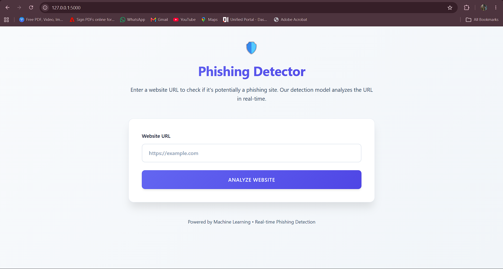
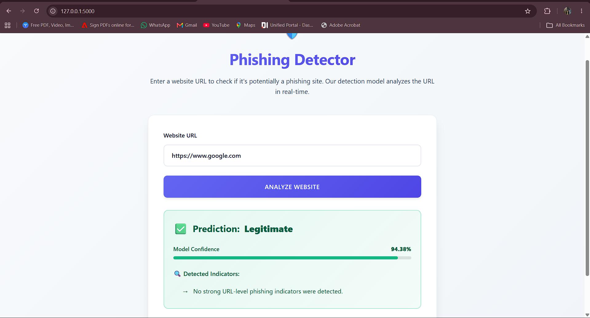
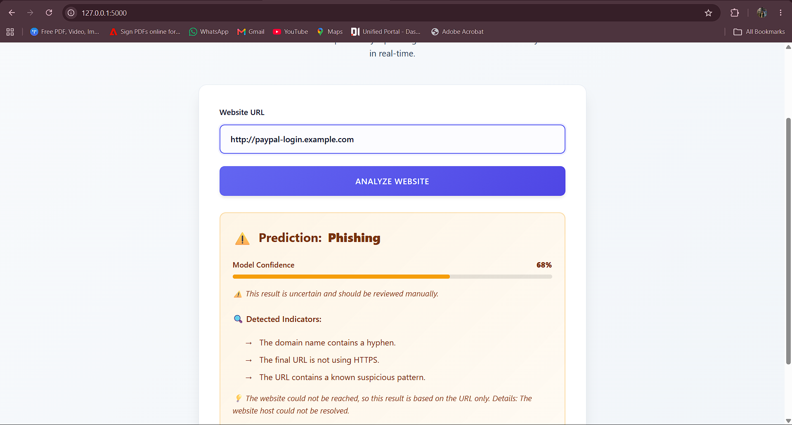

# Phishing Website Detection using Machine Learning

A machine-learning-based web application that analyzes a user-supplied URL and predicts whether it is **Phishing** or **Legitimate**.

The project combines **feature extraction, machine learning, model evaluation, and Flask deployment** into an end-to-end phishing detection system.

**Workflow:**

`URL Input → Feature Extraction → Feature Validation → Random Forest → Prediction → Confidence & Indicators`

---

## Project Overview

Phishing websites are designed to deceive users into revealing sensitive information such as login credentials, financial information, or personal data.

This project explores the use of machine learning to identify phishing websites using URL and website-related characteristics. The model-development phase uses the **UCI Phishing Websites Dataset**, which contains 30 pre-extracted features.

The final system extends the machine-learning model into a Flask-based web application where a user can enter a URL and receive a prediction along with confidence and detected indicators.

---

## Key Features

- URL-based phishing detection
- Automated feature extraction from submitted URLs
- Random Forest classification
- 30-feature representation aligned with the training model
- Saved model and feature-column artifacts
- Model confidence using `predict_proba()`
- Detection of suspicious URL indicators
- HTTPS and URL-structure analysis
- Safe HTTP/HTTPS page fetching
- Protection against local/private network targets
- Redirect and request-size limits
- Request timeouts
- User-friendly handling of network failures
- Flask web interface
- Developer logging for debugging and analysis

---

## Machine Learning Pipeline

The project follows the following pipeline:

```text
                    User enters URL
                          │
                          ▼
                  URL validation
                          │
                          ▼
                  Feature extraction
                          │
                          ▼
              Feature-order validation
                          │
                          ▼
                Random Forest model
                          │
                          ▼
             ┌────────────┴────────────┐
             │                         │
             ▼                         ▼
        Prediction                Probability
             │                         │
             └────────────┬────────────┘
                          ▼
             Confidence + Indicators
                          │
                          ▼
              Phishing / Legitimate

```


## Dataset

The model-development phase uses the **UCI Phishing Websites Dataset**.

The dataset contains **30 pre-extracted characteristics** related to phishing website behavior and URL structure.

### Example Features

- `having_IP_Address`
- `URL_Length`
- `Shortining_Service`
- `having_At_Symbol`
- `double_slash_redirecting`
- `Prefix_Suffix`
- `having_Sub_Domain`
- `SSLfinal_State`
- `URL_of_Anchor`
- `Links_in_tags`
- `SFH`
- `Submitting_to_email`
- `Abnormal_URL`
- `Redirect`
- `on_mouseover`
- `RightClick`
- `popUpWindow`
- `Iframe`
- `age_of_domain`
- `DNSRecord`
- `web_traffic`
- `Page_Rank`
- `Google_Index`
- `Statistical_report`

The original dataset is used for **offline model training and evaluation**, while the deployed application performs feature extraction from a submitted URL.

---

## Models Evaluated

Multiple machine-learning algorithms were explored during the model-development phase:

| Model | Purpose |
|---|---|
| Logistic Regression | Baseline classification model |
| Support Vector Machine | Advanced classification approach |
| Decision Tree | Interpretable tree-based model |
| Random Forest | Ensemble model and final deployed classifier |

The experiments include model comparison and evaluation using classification metrics and ROC-AUC analysis.

The final web application uses the trained **Random Forest** model.

---

## Model and Confidence

The deployed Random Forest model was trained using the 30-feature representation from the UCI dataset.

The application stores the trained model and its expected feature order:

```text
models/
├── feature_columns.joblib
└── phishing_rf_model.joblib
```

`feature_columns.joblib` stores the exact feature order expected by the trained model.

Before prediction, the application verifies the extracted feature representation against this saved feature order. This helps prevent an accidental **feature-order mismatch** between training and inference.

### Confidence Calculation

Model confidence is obtained using:

```python
model.predict_proba()
```

The application marks predictions below **70% confidence** as uncertain and recommends manual review.

A model probability should not be interpreted as a guarantee that a website is safe.

---

## Application Screenshots

### Home Interface

The application provides a simple interface where the user can enter a complete HTTP or HTTPS URL.



### Legitimate Website Detection

Example prediction for `https://www.google.com`.



### Phishing Website Detection

Example demonstration using a synthetic suspicious URL pattern. The application reports the prediction, confidence, and detected indicators.



---

## Project Structure

```text
phishing-website-detection-ml/
│
├── app.py
├── feature_extractor.py
├── requirements.txt
├── README.md
│
├── models/
│   ├── feature_columns.joblib
│   └── phishing_rf_model.joblib
│
├── templates/
│   └── index.html
│
├── notebooks/
│   └── Phishing Website detection.ipynb
│
├── screenshots/
│   ├── home.png
│   ├── legitimate-result.png
│   └── phishing-result.png
│
├── documentation/
│   ├── AUDIT_REPORT.md
│   ├── FEATURE_ENCODING_VERIFICATION.md
│   ├── FEATURE_EXTRACTION_AUDIT.md
│   └── TECHNICAL_GUIDE.md
│
└── .gitignore
```

### Main Components

- **`app.py`** — Flask application, routes, model loading, prediction logic, security controls, and developer logging.
- **`feature_extractor.py`** — extracts URL and safely fetched page-content features.
- **`models/`** — trained Random Forest model and saved feature-order information.
- **`templates/index.html`** — web interface for URL submission and prediction results.
- **`notebooks/`** — machine-learning experiments, preprocessing, model training, comparison, evaluation, and artifact generation.
- **`documentation/`** — technical audits and verification documents.
- **`screenshots/`** — application screenshots used in this README.

---

## Technologies Used

### Programming Language

- Python

### Machine Learning

- Scikit-learn
- Logistic Regression
- Support Vector Machine
- Decision Tree
- Random Forest
- StandardScaler
- Cross-validation
- ROC-AUC analysis

### Web Development

- Flask
- HTML
- CSS
- Jinja templates

### Development Tools

- Jupyter Notebook
- VS Code
- Git
- GitHub

---

## Installation and Execution

### 1. Clone the Repository

```bash
git clone https://github.com/Biplab-7/phishing-website-detection-ml.git
cd phishing-website-detection-ml
```

### 2. Create a Virtual Environment

```powershell
python -m venv .venv
```

### 3. Activate the Environment

On Windows PowerShell:

```powershell
.\.venv\Scripts\Activate.ps1
```

### 4. Install Dependencies

```bash
pip install -r requirements.txt
```

### 5. Start the Flask Application

```bash
python app.py
```

### 6. Open the Application

Navigate to:

```text
http://127.0.0.1:5000
```

Submit a complete URL beginning with:

```text
http://
```

or:

```text
https://
```

---

## Example Prediction

The application returns information such as:

```text
Prediction: Legitimate
Model Confidence: 94.38%
```

or:

```text
Prediction: Phishing
Model Confidence: 68%
```

It can also display detected indicators such as:

- Suspicious URL patterns
- Hyphenated domain names
- Lack of HTTPS
- Other URL-level phishing characteristics
- Whether the submitted website could be reached for additional analysis

Predictions with lower confidence may be marked as uncertain and should be manually reviewed.

---

## Security and Robustness

The application includes several safeguards for URL analysis:

- Accepts only HTTP(S) URLs
- Blocks local and private network targets
- Limits redirects
- Limits request size
- Uses request timeouts
- Hides internal exceptions from end users
- Provides basic browser security headers
- Falls back to URL-only analysis when a website cannot be fetched
- Displays network-related warnings to the user

These controls are intended to make the demonstration safer and more robust than a simple URL classifier.

---

## Important Limitations

The UCI dataset contains historical features such as:

- Domain age
- Domain registration length
- PageRank
- Google indexing
- Web traffic
- Backlinks

Some of these characteristics cannot be reliably recovered from a URL alone without external data sources.

Therefore, the deployed application may use neutral/default values for unavailable signals. Consequently, **live predictions should not be considered directly equivalent to the offline dataset evaluation results**.

For a production-quality system, the model should be retrained using features that are reliably available at inference time, or integrated with trusted external services such as WHOIS, reputation, Safe Browsing, and traffic providers.

---

## Future Improvements

Potential improvements include:

- Training with a larger and more recent phishing dataset
- Improving real-time feature extraction
- Integrating trusted domain-reputation services
- Adding WHOIS-based domain information
- Adding explainable-AI techniques such as SHAP
- Improving confidence calibration
- Adding automated model monitoring
- Deploying the application to a cloud platform
- Adding automated testing and CI/CD
- Periodically retraining the model with newly observed phishing patterns

---

## Disclaimer

This project is intended for **educational, research, and demonstration purposes**.

A machine-learning prediction is not a guarantee that a website is safe or malicious. Users should not visit a website solely because this application labels it as legitimate.

Always use appropriate security tools and independent verification when dealing with suspicious websites.

---

## Author

**Biplab Bag Yadav**

MCA Final-Year Project

Manipal Institute of Technology